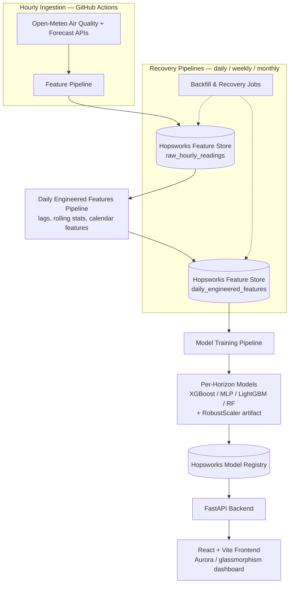

# Aura — Pearls AQI Predictor

**A serverless, end-to-end machine learning system forecasting 4-day-ahead Air Quality Index (AQI) for Lahore, Pakistan.**

Built as the capstone project for the **10Pearls Shine Internship Program** (Data Science track).


---

## Overview

Aura predicts Lahore's Air Quality Index for the next four days using an automated pipeline: hourly data ingestion → a two-tier feature store → per-horizon models (gradient-boosted trees, random forest, and a neural net) → SHAP-based explainability → a live dashboard. Every architectural choice below was made for a stated reason, not by default — see [Tech Stack & Rationale](#tech-stack--rationale).

<!-- Screenshot: docs/images/dashboard.png -->


For the full project write-up — architecture rationale, methodology, challenges encountered, and limitations — see [`docs/documentation.pdf`](docs/documentation.pdf).

## Live Demo
- **Dashboard:** https://aura-aqi.vercel.app/
- **API:** https://aura-pearls-aqi-predictor.fastapicloud.dev/

---

## Architecture



This follows the **FTI (Feature / Training / Inference) pipeline pattern**: feature computation, model training, and inference are decoupled and each read/write through the Hopsworks Feature Store and Model Registry rather than passing data directly between stages.

> **Note on automation:** the 7 GitHub Actions workflows (hourly ingestion + daily/weekly/monthly recovery + daily model training) were intentionally paused mid-development after hitting ~80% of the Hopsworks free-tier compute quota, to avoid running out before submission. Every pipeline was manually run and verified working during the pause — `raw_hourly_readings` and `daily_engineered_features` were kept current through manual backfill in the meantime. Workflows remain disabled through submission; instead, an on-demand backfill flow (triggered from the dashboard's Backfill page or directly via `api/backfill/raw` and `api/backfill/engineered`) brings both feature stores up to date and retrains the model, without relying on the paused scheduled automation.

> **Note on the native dependency fix:** XGBoost and LightGBM both require the `libgomp.so.1` OpenMP runtime library at import time. FastAPI Cloud's build container does not ship it and offers no mechanism to add OS-level dependencies for the deployment target, so `libgomp.so.1` is vendored directly into the repo (`lib/`) and force-loaded via `ctypes` at the top of `backend/app/main.py`, before any model-loading code runs.

---

## Tech Stack & Rationale

| Layer                          | Choice                                                                                             | Why                                                                                                                                                                                                                                     |
|--------------------------------|----------------------------------------------------------------------------------------------------|-----------------------------------------------------------------------------------------------------------------------------------------------------------------------------------------------------------------------------------------|
| Feature store / model registry | **Hopsworks**                                                                                      | Genuine free tier, purpose-built for the FTI pipeline pattern, no billing account required                                                                                                                                              |
| Scheduler                      | **GitHub Actions**                                                                                 | Serverless by nature — Apache Airflow was the alternative, but it needs a persistently hosted server, which conflicts with the project's "100% serverless" requirement                                                                  |
| Data source                    | **Open-Meteo** (Air Quality + Forecast APIs)                                                       | Free historical hourly data going back to Aug 2022 for Lahore; migrated from AQICN/OpenWeather after discovering neither offered free historical access needed for model training                                                       |
| Backend                        | **FastAPI**                                                                                        | Brief allows Flask or FastAPI — FastAPI chosen for async support, Pydantic request/response validation, and auto-generated OpenAPI docs                                                                                                 |
| Frontend                       | **Vite + React + TypeScript**                                                                      | Brief allows Streamlit/Gradio or a custom UI — React chosen for full design control over the custom aurora/glassmorphism dashboard                                                                                                      |
| Statistical models             | **Scikit-learn** (Random Forest) + **XGBoost** + **LightGBM**                                      | Ridge served as the initial statistical baseline; per-horizon re-evaluation (Sep 2026) found gradient-boosted trees outperformed Ridge/RF on Days 1 and 3, so XGBoost/LightGBM were promoted to production for those horizons           |
| Deep learning model            | **TensorFlow** (Dense NN / MLP)                                                                    | Required by the brief to compare statistical vs. deep learning approaches; LSTM was scoped as a stretch goal and not pursued (see Limitations)                                                                                          |
| Production model selection     | **Per-horizon model type** — XGBoost (Day 1), MLP (Day 2), LightGBM (Day 3), Random Forest (Day 4) | Independent 5-fold `RandomizedSearchCV` per forecast horizon found different model types won on different days; no single model type dominated all four horizons                                                                        |
| Explainability                 | **SHAP** (`TreeExplainer` for XGBoost/LightGBM/RF, `DeepExplainer` for the Day 2 MLP)              | Required by the brief                                                                                                                                                                                                                   |
| AQI computation                | **Open-Meteo's native `us_aqi` field**                                                             | Originally computed locally via US EPA breakpoint methodology; superseded once discovered Open-Meteo provides it natively. Original EPA logic preserved in `src/archived/epa_aqi/` for reference.                                       |
| Frontend hosting               | **Vercel**                                                                                         | Free tier, zero-config Vite/React deploys, monorepo support via root directory config                                                                                                                                                   |
| Backend hosting                | **FastAPI Cloud**                                                                                  | Official hosting platform from the FastAPI maintainers                                                                                                                                                                                  |
| Native dependency workaround   | **Vendored `libgomp.so.1`**, force-loaded via `ctypes` in `backend/app/main.py`                    | XGBoost and LightGBM require `libgomp` at import time, but FastAPI Cloud's build container doesn't include it as an OS package and offers no way to add one — vendoring and force-loading the shared library was the only available fix |

---

## Features

- Two-tier feature store: permanent raw hourly readings + daily engineered features (lags, 3/7-day rolling stats, calendar features)
- ~4 years of historical Lahore air quality + weather data (Aug 2022 – present, as of the last backfill)
- Independently feature-selected and hyperparameter-tuned model for each of the 4 forecast horizons — XGBoost (Day 1), MLP (Day 2), LightGBM (Day 3), Random Forest (Day 4)
- SHAP explainability per forecast horizon, run against each day's selected production model — surfacing the top drivers behind each prediction
- Hazardous AQI alerting built directly into the dashboard: each forecast card's hue, symbol, and border/symbol color respond dynamically to that day's AQI severity level
- Aurora-themed, glassmorphism dashboard built as a custom React UI
- All ingestion and recovery pipelines (hourly, daily, weekly, monthly engineered) manually run and verified end-to-end
- Full Statistics page: live current AQI, today's prediction, per-pollutant readings (PM10, PM2.5, CO, NO₂, SO₂, O₃), and current weather conditions (temperature, humidity, pressure, wind speed, dew point), each timestamped
- On-demand data recovery: a Backfill page detects whether the feature stores are behind and lets the user trigger a raw + engineered backfill and model retrain directly from the dashboard, with live progress and state feedback
- Stale-data awareness: Prediction and Stats pages detect out-of-date predictions and surface a notification card with a direct link to Backfill.
- Technical Details page: a per-day toggle showing that forecast horizon's production model type, model version, target, evaluation metrics, and a local (per-prediction) SHAP explanation.
- City lookup: search any city to get a 4-day AQI prediction for it (geocoded, fetched, and engineered on the fly), with a notice that accuracy may be lower since all production models were trained exclusively on Lahore data.

---

## Model Results

**Initial model comparison** (shared 23-feature set, mean R² across all 4 forecast horizons):

| Model            | Configuration                                                 | Mean R² |
|------------------|---------------------------------------------------------------|---------|
| Random Forest    | 800 trees, depth 20, split/leaf 7, feature/sample subsampling | 0.5616  |
| Ridge Regression | alpha = 0.01                                                  | 0.5818  |
| Dense NN (MLP)   | 32 units, L2 + dropout                                        | 0.5866  |

Based on this, per-horizon feature selection and tuning was run independently for each forecast day — first using the MLP architecture across all four horizons, then re-evaluated per horizon across model types in a follow-up round, settling on the model type that performed best for each specific day:

**Final per-horizon results** (best model type per horizon, selected via independent per-day CV tuning and RFECV feature selection):

| Horizon | Model | RMSE | MAE | R² |
|---|---|---|---|---|
| Day 1 | XGBoost | 15.53 | 11.12 | 0.898 |
| Day 2 | MLP | 27.97 | 21.23 | 0.659 |
| Day 3 | LightGBM | 31.02 | 24.17 | 0.561 |
| Day 4 | Random Forest | 32.77 | 25.46 | 0.498 |

Day 1 forecasts are consistently strong; accuracy drops for Days 2–4, which is expected — longer-horizon air quality forecasting has less signal to work with. See [Limitations](#known-limitations).

Feature selection was run independently per forecast horizon and per model type, using RFECV as a starting point — Ridge as the estimator for the original per-horizon MLP experimentation, and each model's own algorithm (XGBoost, LightGBM, Random Forest) for the September model-type re-evaluation that determined the current production models. Selections were manually iterated on and refined beyond RFECV's raw output where it would have broken feature-group consistency (e.g. dropping only part of a pollutant's temporal block).

### Explainability (SHAP)

SHAP explainability is run per forecast horizon against that horizon's production model, using `shap.TreeExplainer` for the tree-based models (XGBoost, LightGBM, Random Forest) and `shap.DeepExplainer` for the Day 2 MLP.

- **Day 1 (XGBoost):** `pm25_today` is the dominant driver by a wide margin, followed by `pm10_today` and `pm25_roll_mean_3`; `no2_today`, `aqi_today`, and `wind_spd_today` form a secondary tier.
- **Day 2 (MLP):** `co_today` dominates by a large margin, with `pm25_today`, `pm25_roll_mean_7`, `pm25_roll_mean_3`, and `pm10_roll_mean_7` forming a distant secondary tier.
- **Day 3 (LightGBM):** `pm25_lag_1` is the top driver, followed closely by `aqi_change_rate` and `pm25_roll_std_7`; `humidity_lag_1` and `dew_pt_today` are secondary.
- **Day 4 (Random Forest):** `pm25_lag_1` again leads, followed by `aqi_change_rate`, `o3_roll_mean_7`, `humidity_lag_1`, and `pm25_roll_std_7`.

PM2.5-derived features (same-day value, lag, or rolling stats) are the consistent top driver across all four horizons, though the exact form and which secondary pollutant/weather features matter shifts by model type and horizon.

<!-- SHAP feature importance plot: docs/images/day_1_shap_bee_plot.png -->


---

## Project Structure

```
aura-pearls-aqi-predictor/
├── backend/
│   └── app/
│       ├── main.py
│       ├── services/
│       │   ├── feature_service.py
│       │   ├── model_service.py
│       │   ├── prediction_service.py
│       │   └── ...
│       ├── routes/
│       │   ├── prediction.py
│       │   ├── current_air_quality.py
│       │   ├── current_weather.py
│       │   └── ...
│       ├── schemas/
│       │   ├── prediction.py
│       │   ├── current_air_quality.py
│       │   ├── current_weather.py
│       │   └── ...
│       └── ...                   # utils etc
├── frontend/
│   ├── src/
│   │   ├── App.tsx
│   │   ├── pages/
│   │   │   ├── PredictionPage.tsx
│   │   │   ├── BackfillPage.tsx
│   │   │   └── StatsPage.tsx
│   │   │   └── ...               # Technical details and city page
│   │   ├── components/
│   │   │   ├── Aurora.tsx        # aurora background (wave-based)
│   │   │   ├── Sidebar.tsx       # + IceTexture (cracked-ice, refraction)
│   │   │   ├── common/           # contain reusable components
│   │   │   ├── prediction/       # components related to prediction page
│   │   │   └── ...               # footer, backfill, stats directory etc
│   │   ├── assets/
│   │   ├── hooks/                # useCurrentAirQuality, useCurrentWeather, usePrediction, etc
│   │   └── ...                   # other files + utils directory
│   ├── public/
│   │   └── logo.png
│   └── ...
├── src/
│   ├── feature_pipeline/         # hourly ingestion
│   ├── engineered_features/      # daily feature engineering
│   ├── model_training/           # training pipeline, per-horizon model build logic (XGBoost/MLP/LightGBM/RF)
│   └── ...                       # modeling + common + backfill + archived
├── notebooks/                  
│   ├── eda/                      # EDA, feature experiments, model experimentation, SHAP
│   └── model_experimentation/    # model experimentation, SHAP
├── .github/
│   ├── workflows/                # 7 pipelines
│   └── actions/                  # setup-python-env, run-pipeline composite actions
├── scripts/                                          
├── lib/                          # vendored libgomp.so.1 (FastAPI Cloud native dependency workaround)
├── docs/images/                  # README visuals
├── requirements.txt
├── pyproject.toml                # uv-based dependency set, used only for FastAPI Cloud deployment
├── uv.lock
├── .env.example
├── LICENSE (MIT)
├── README.md
└── ...
```

---

## Setup & Installation

### Prerequisites
- Python 3.13
- Node.js + npm
- A [Hopsworks](https://www.hopsworks.ai/) account and API key

### Backend

> Two dependency setups exist for two different purposes: `requirements.txt` (pip) is used for local development and all GitHub Actions pipelines. A separate `pyproject.toml` + `uv.lock` (uv) exists solely for the FastAPI Cloud deployment target, since that platform resolves dependencies via `uv`. Use `requirements.txt` for local dev below; the deployment path is documented in `docs/documentation.pdf`.

```bash
# from repo root
pip install -r requirements.txt
pip install hopsworks==5.4 --no-deps
```

Create a `.env` file in the root directory (see `.env.example`):

```env
# Hopsworks API
HOPSWORKS_API_KEY=your_hopsworks_api_key

# Frontend url (or whatever you prefer)
FRONTEND_HOST=127.0.0.1
FRONTEND_PORT=5173

# Backend url (or whatever you prefer)
VITE_BACKEND_HOST=127.0.0.1
VITE_BACKEND_PORT=8000
```

Run the development server:

```bash
python run_backend.py
```

By default this serves on `http://localhost:8000` (uvicorn's default port — adjust if you've configured a different one).

For a production-style run (no auto-reload):

```bash
uvicorn backend.app.main:app --host 0.0.0.0 --port 8000
```

> This project currently runs as a single-process demo deployment. For a heavier production setup, running behind Gunicorn with Uvicorn workers is the common next step — not something this project currently does, just worth knowing if it were to scale.

### Frontend

```bash
cd frontend
npm install
npm run dev
```

By default, this serves on `http://localhost:5173` (Vite's default dev port).

> Note: `frontend/vercel.json` is required for correct routing on Vercel — without it, React Router routes 404 on refresh/direct navigation.

---

## Known Limitations

- **Non-Lahore predictions use out-of-distribution models.** The City page supports arbitrary cities via on-demand geocoding and feature engineering, but the underlying models were trained exclusively on Lahore data — predictions for other cities may be less accurate, which is surfaced to the user as an explicit notice on that page.
- **Forecast accuracy declines with horizon length.** Day 1 R² is 0.898; Days 2–4 range 0.498–0.659. This is a genuine result of the underlying forecasting difficulty, not a bug — reported honestly rather than tuned away.

---

## Roadmap

- LSTM model as a deep learning stretch goal (scoped in the original plan, not pursued due to limited data volume relative to tuning cost)

---

## Acknowledgments

Built as the Data Science track capstone for the **10Pearls Shine Internship Program**.

---

## Author

**Ali Hassan**

- GitHub: [github/ali591195](https://github.com/ali591195)
- Hugging Face: [huggingface/ali591195](https://huggingface.co/ali591195)
- LinkedIn: [linkedin/ali-hassan-483977245](https://www.linkedin.com/in/ali-hassan-483977245/)

---

## License

Distributed under the MIT License. See `LICENSE` for details.