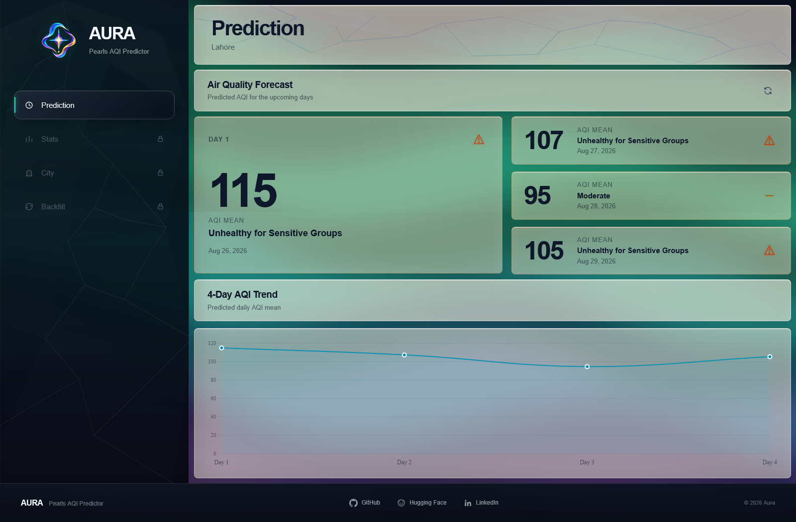
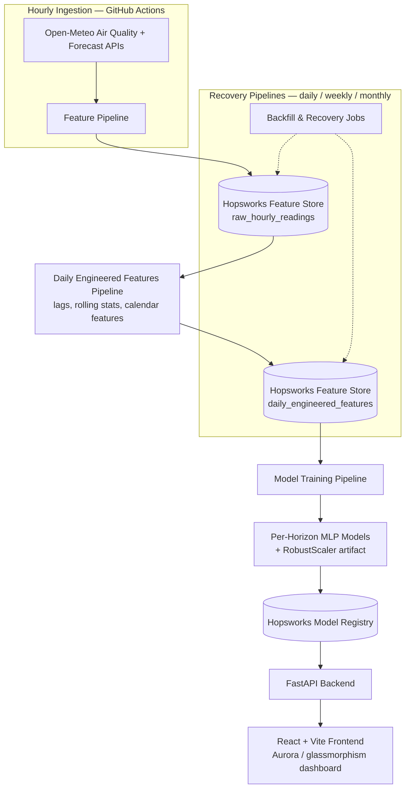
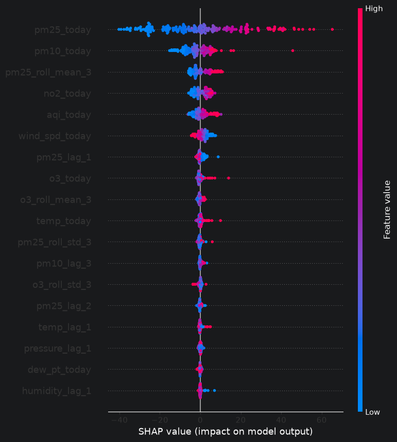

# Aura — Pearls AQI Predictor

**A serverless, end-to-end machine learning system forecasting 4-day-ahead Air Quality Index (AQI) for Lahore, Pakistan.**

Built as the capstone project for the **10Pearls Shine Internship Program** (Data Science track).


---

## Overview

Aura predicts Lahore's Air Quality Index for the next four days using an automated pipeline: hourly data ingestion → a two-tier feature store → per-horizon deep learning models → SHAP-based explainability → a live dashboard. Every architectural choice below was made for a stated reason, not by default — see [Tech Stack & Rationale](#tech-stack--rationale).

<!-- Screenshot: docs/images/dashboard.png -->


For the full project write-up — architecture rationale, methodology, challenges encountered, and limitations — see [`docs/documentation.pdf`](docs/documentation.pdf).

## Live Demo
- **Dashboard:** https://aura-aqi.vercel.app/
- **API:** https://aura-pearls-aqi-predictor.fastapicloud.dev/

---

## Architecture



This follows the **FTI (Feature / Training / Inference) pipeline pattern**: feature computation, model training, and inference are decoupled and each read/write through the Hopsworks Feature Store and Model Registry rather than passing data directly between stages.

> **Note on automation:** the 7 GitHub Actions workflows (hourly ingestion + daily/weekly/monthly recovery + daily model training) were intentionally paused mid-development after hitting ~80% of the Hopsworks free-tier compute quota, to avoid running out before submission. Every pipeline was manually run and verified working during the pause — `raw_hourly_readings` and `daily_engineered_features` were kept current through manual backfill in the meantime. Workflows are re-enabled for submission so scheduled automation runs live.

---

## Tech Stack & Rationale

| Layer | Choice | Why                                                                                                                                                                                               |
|---|---|---------------------------------------------------------------------------------------------------------------------------------------------------------------------------------------------------|
| Feature store / model registry | **Hopsworks** | Genuine free tier, purpose-built for the FTI pipeline pattern, no billing account required                                                                                                        |
| Scheduler | **GitHub Actions** | Serverless by nature — Apache Airflow was the alternative, but it needs a persistently hosted server, which conflicts with the project's "100% serverless" requirement                            |
| Data source | **Open-Meteo** (Air Quality + Forecast APIs) | Free historical hourly data going back to Aug 2022 for Lahore; migrated from AQICN/OpenWeather after discovering neither offered free historical access needed for model training                 |
| Backend | **FastAPI** | Brief allows Flask or FastAPI — FastAPI chosen for async support, Pydantic request/response validation, and auto-generated OpenAPI docs                                                           |
| Frontend | **Vite + React + TypeScript** | Brief allows Streamlit/Gradio or a custom UI — React chosen for full design control over the custom aurora/glassmorphism dashboard                                                                |
| Baseline models | **Scikit-learn** (Random Forest, Ridge Regression) | Required by the brief as a statistical baseline against the deep learning approach                                                                                                                |
| Deep learning model | **TensorFlow** (Dense NN / MLP) | Required by the brief to compare statistical vs. deep learning approaches; LSTM was scoped as a stretch goal and not pursued (see Limitations)                                                    |
| Explainability | **SHAP** (`shap.DeepExplainer`) | Required by the brief                                                                                                                                                                             |
| AQI computation | **Open-Meteo's native `us_aqi` field** | Originally computed locally via US EPA breakpoint methodology; superseded once discovered Open-Meteo provides it natively. Original EPA logic preserved in `src/archived/epa_aqi/` for reference. |
| Frontend hosting | **Vercel** | Free tier, zero-config Vite/React deploys, monorepo support via root directory config                                                                                                             |
| Backend hosting | **FastAPI Cloud** | Official hosting platform from the FastAPI maintainers                                                                                                                                            |

---

## Features

- Two-tier feature store: permanent raw hourly readings + daily engineered features (lags, 3/7-day rolling stats, calendar features)
- ~4 years of historical Lahore air quality + weather data (Aug 2022 – present, as of the last backfill)
- Independently feature-selected and hyperparameter-tuned MLP models for each of the 4 forecast horizons
- SHAP explainability per forecast horizon, surfacing the top drivers behind each prediction
- Hazardous AQI alerting built directly into the dashboard: each forecast card's hue, symbol, and border/symbol color respond dynamically to that day's AQI severity level
- Aurora-themed, glassmorphism dashboard built as a custom React UI
- All ingestion and recovery pipelines (hourly, daily, weekly, monthly engineered) manually run and verified end-to-end
- Full Statistics page: live current AQI, today's prediction, per-pollutant readings (PM10, PM2.5, CO, NO₂, SO₂, O₃), and current weather conditions (temperature, humidity, pressure, wind speed, dew point), each timestamped

---

## Model Results

**Initial model comparison** (shared 23-feature set, mean R² across all 4 forecast horizons):

| Model | Configuration | Mean R² |
|---|---|---|
| Random Forest | 800 trees, depth 20, split/leaf 7, feature/sample subsampling | 0.5616 |
| Ridge Regression | alpha = 0.01 | 0.5818 |
| Dense NN (MLP) | 32 units, L2 + dropout | 0.5866 |

Based on this, per-horizon feature selection and tuning was run independently for each forecast day, using the MLP architecture (which had shown the strongest ceiling):

**Final per-horizon results** (winning MLP configuration, 128 units, L2=1e-3, learning rate 5e-3, Huber loss, Ridge-RFECV-selected features per horizon):

| Horizon | RMSE | MAE | R² |
|---|---|---|---|
| Day 1 | 12.52 | 9.33 | **0.901** |
| Day 2 | 25.59 | 18.23 | 0.593 |
| Day 3 | 28.89 | 21.11 | 0.509 |
| Day 4 | 29.59 | 21.77 | 0.506 |

Day 1 forecasts are consistently strong; accuracy drops for Days 2–4, which is expected — longer-horizon air quality forecasting has less signal to work with. See [Limitations](#known-limitations).

Feature selection was run independently per forecast horizon starting from all 49 features, using RFECV (Ridge as the estimator) as a starting point rather than a final answer — selections were manually iterated on and refined beyond RFECV's raw output for each horizon.

### Explainability (SHAP)

PM2.5 (today's value and its rolling mean) is the consistent top driver across all four forecast horizons — its exact form shifts from same-day value (Day 1) toward the 7-day rolling mean as the horizon lengthens (Days 2–4), consistent with longer-horizon forecasts leaning more on smoothed trend than the latest single reading.

<!-- SHAP feature importance plot: docs/images/day_1_shap_bee_plot.png -->


---

## Project Structure

```
aura-pearls-aqi-predictor/
├── backend/
│   └── app/
│       ├── main.py
│       ├── services/
│       │   ├── feature_service.py
│       │   ├── model_service.py
│       │   ├── prediction_service.py
│       │   └── ...
│       ├── routes/
│       │   ├── prediction.py
│       │   ├── current_air_quality.py
│       │   └── current_weather.py
│       └── schemas/
│           ├── prediction.py
│       │   ├── current_air_quality.py
│       │   └── current_weather.py
├── frontend/
│   ├── src/
│   │   ├── App.tsx
│   │   ├── pages/
│   │   │   ├── PredictionPage.tsx
│   │   │   └── StatsPage.tsx
│   │   ├── components/
│   │   │   ├── Aurora.tsx        # aurora background (wave-based)
│   │   │   ├── Sidebar.tsx       # + IceTexture (cracked-ice, refraction)
│   │   │   ├── common/           # contain reusable components
│   │   │   ├── prediction/       # components related to prediction page
│   │   │   └── ...               # footer + stats directory + sidebar ice texture + css files
│   │   ├── assets/
│   │   ├── hooks/                # useCurrentAirQuality, useCurrentWeather, usePrediction
│   │   └── ...                   # other files + utils directory
│   ├── public/
│   │   └── logo.png
│   └── ...
├── src/
│   ├── feature_pipeline/         # hourly ingestion
│   ├── engineered_features/      # daily feature engineering
│   ├── model_training/           # training pipeline, MLP build logic
│   └── ...                       # modeling + common + backfill + archived
├── notebooks/                  
│   ├── eda/                      # EDA, feature experiments, model experimentation, SHAP
│   └── model_experimentation/    # model experimentation, SHAP
├── .github/
│   ├── workflows/                # 7 pipelines
│   └── actions/                  # setup-python-env, run-pipeline composite actions
├── scripts/                                          
├── docs/images/                  # README visuals
├── requirements.txt
├── pyproject.toml                # uv-based dependency set, used only for FastAPI Cloud deployment
├── uv.lock
├── .env.example
├── LICENSE (MIT)
├── README.md
└── ...
```

---

## Setup & Installation

### Prerequisites
- Python 3.13
- Node.js + npm
- A [Hopsworks](https://www.hopsworks.ai/) account and API key

### Backend

> Two dependency setups exist for two different purposes: `requirements.txt` (pip) is used for local development and all GitHub Actions pipelines. A separate `pyproject.toml` + `uv.lock` (uv) exists solely for the FastAPI Cloud deployment target, since that platform resolves dependencies via `uv`. Use `requirements.txt` for local dev below; the deployment path is documented in `docs/documentation.pdf`.

```bash
# from repo root
pip install -r requirements.txt
pip install hopsworks==5.4 --no-deps
```

Create a `.env` file in the root directory (see `.env.example`):

```env
# Hopsworks API
HOPSWORKS_API_KEY=your_hopsworks_api_key

# Frontend url (or whatever you prefer)
FRONTEND_HOST=127.0.0.1
FRONTEND_PORT=5173

# Backend url (or whatever you prefer)
VITE_BACKEND_HOST=127.0.0.1
VITE_BACKEND_PORT=8000
```

Run the development server:

```bash
python run_backend.py
```

By default this serves on `http://localhost:8000` (uvicorn's default port — adjust if you've configured a different one).

For a production-style run (no auto-reload):

```bash
uvicorn backend.app.main:app --host 0.0.0.0 --port 8000
```

> This project currently runs as a single-process demo deployment. For a heavier production setup, running behind Gunicorn with Uvicorn workers is the common next step — not something this project currently does, just worth knowing if it were to scale.

### Frontend

```bash
cd frontend
npm install
npm run dev
```

By default, this serves on `http://localhost:5173` (Vite's default dev port).

---

## Known Limitations

- **Single city only.** The model and feature store currently support Lahore exclusively. A city-selection feature is scoped but not built — see Roadmap.
- **Forecast accuracy declines with horizon length.** Day 1 R² is 0.901; Days 2–4 range 0.51–0.59. This is a genuine result of the underlying forecasting difficulty, not a bug — reported honestly rather than tuned away.

---

## Roadmap

- City-selection page (sidebar entry exists, locked) — pending a feasibility check on whether 7 days of prior history can be backfilled on-demand for an arbitrary new city
- LSTM model as a deep learning stretch goal (scoped in the original plan, not pursued due to limited data volume relative to tuning cost)

---

## Acknowledgments

Built as the Data Science track capstone for the **10Pearls Shine Internship Program**.

---

## Author

**Ali Hassan**

- GitHub: [github/ali591195](https://github.com/ali591195)
- Hugging Face: [huggingface/ali591195](https://huggingface.co/ali591195)
- LinkedIn: [linkedin/ali-hassan-483977245](https://www.linkedin.com/in/ali-hassan-483977245/)

---

## License

Distributed under the MIT License. See `LICENSE` for details.